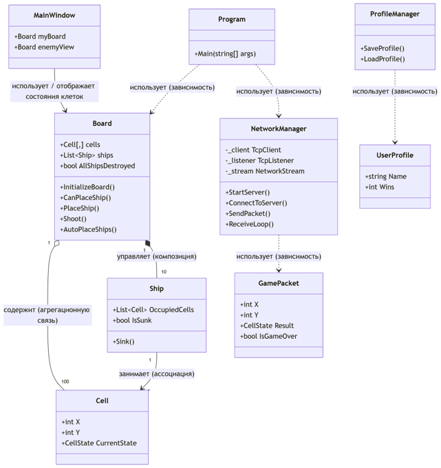
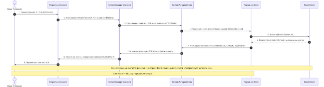
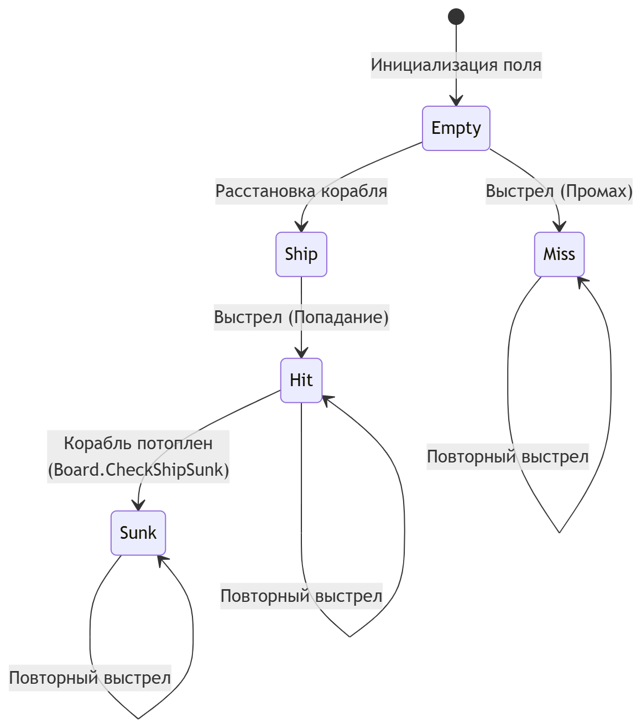

# Практическая работа №1 — Жизненный цикл разработки ПО

## Проект: «Сетевой морской бой (локальный TCP)»

| | |
|:---|:---|
| **Репозиторий** | [github.com/Mihail2398/SeaBattle](https://github.com/Mihail2398/SeaBattle) |
| **Язык** | C# |
| **Фреймворк** | .NET 8, WPF |
| **IDE** | Visual Studio 2022 |
| **Сетевой протокол** | TCP/IP (локальная сеть) |
| **Формат данных** | JSON |

---

## Состав команды

| Участник | Роль |
|:---|:---|
| **Никишин Михаил** | Логика проекта (`Board`, `Cell`, `Ship`, `AutoPlaceShips`) |
| **Козлов Виталий** | GUI (интерфейс) — WPF, XAML-разметка (`MainWindow.xaml`) |
| **Чепорьков Артём** | TCP connect (сетевая часть) — `NetworkManager`, `GamePacket` |
| **Матронски Илья** | Документация, тестирование, отчётность |

---

## Описание проекта

Клиент-серверное десктоп-приложение для двух игроков, реализующее классическую игру **«Морской бой»** по локальной сети.

### Основные возможности

- Игровое поле **10×10** клеток
- **Автоматическая расстановка** кораблей (стандартный набор: 1×4, 2×3, 3×2, 4×1)
- **Сетевой режим** по TCP: создание игры (хост) и подключение (клиент)
- **Визуальная индикация** состояний клеток: пусто, корабль, промах, попадание, потоплен
- **Проверка очерёдности** ходов с индикацией на экране
- **Определение победителя** при уничтожении всех кораблей противника
- **Сохранение профиля** игрока (имя, победы) в локальный JSON-файл

---

## Стек технологий

- **C#** — язык программирования
- **.NET 8** — целевая платформа
- **WPF** — графический интерфейс (Windows Presentation Foundation)
- **TCP/IP** — сетевое взаимодействие (`System.Net.Sockets`)
- **JSON** — формат обмена данными (`System.Text.Json`)
- **Git + GitHub** — контроль версий и совместная разработка

---

## Структура проекта

```
SeaBattle/
├── SeaBattle.csproj          # Файл проекта .NET 8 (WinExe, WPF)
├── App.xaml                  # Точка входа WPF-приложения
├── App.xaml.cs
├── MainWindow.xaml           # Главное окно (меню + игровое поле)
├── MainWindow.xaml.cs
├── Program.cs                # Консольный игровой цикл (для тестирования)
├── Logics/
│   ├── Board.cs              # Игровое поле, расстановка, выстрелы
│   ├── Cell.cs               # Клетка: состояния (Empty, Ship, Miss, Hit, Sunk)
│   └── Ship.cs               # Корабль: проверка потопления
└── TSP/
    ├── GameData.cs           # GamePacket, UserProfile, ProfileManager
    └── NetworkManager.cs     # TCP-клиент/сервер, JSON-обмен
```

---

## Архитектура

Приложение построено по **многоуровневой архитектуре**:

```
┌─────────────────────────────┐
│  Presentation Layer (WPF)   │  MainWindow.xaml
├─────────────────────────────┤
│  Application Layer            │  Program.cs / App.xaml
├─────────────────────────────┤
│  Business Logic Layer         │  Board, Ship, Cell
├─────────────────────────────┤
│  Network Layer              │  NetworkManager, GamePacket
├─────────────────────────────┤
│  Data Layer                 │  ProfileManager (JSON)
└─────────────────────────────┘
```

### Содержание отчёта по практике (16 разделов + UML)

1. Сбор требований
2. Классификация требований (функциональные / нефункциональные)
3. Приоритизация (метод **MoSCoW**)
4. Спецификация требований (SRS)
5. Системное проектирование (архитектура, подсистемы)
6. Детальное проектирование (классы, алгоритмы)
7. Проектирование интерфейсов (GUI + API)
8. Проектирование баз данных (JSON-модель)
9. Настройка среды разработки
10. Написание кода (логика, сеть, GUI)
11. Управление версиями (Git, GitHub)
12. Модульное тестирование (14 тест-кейсов)
13. Интеграционное тестирование (4 сценария)
14. Системное тестирование (4 сценария)
15. Приёмочное тестирование (6 критериев)
16. Обучение пользователей (руководство)

---

## UML-диаграммы

### А.1. Диаграмма классов (Class Diagram)



*Основные классы и их связи: Board содержит Cell и Ship, NetworkManager использует GamePacket, ProfileManager работает с UserProfile.*

---

### А.2. Диаграмма последовательности (Sequence Diagram)



*Сценарий сетевого выстрела: от ввода координат до обновления GUI. Валидация происходит на стороне владельца поля — защита от читерства.*

---

### А.3. Диаграмма состояний (State Diagram)



*Жизненный цикл клетки: Empty → Ship / Miss / Hit → Sunk. Miss и Sunk — финальные состояния.*

---

## Как запустить

### Требования
- Windows 10/11
- .NET 8 Runtime (или Visual Studio 2022 с рабочей нагрузкой «Разработка классических приложений .NET»)

### Сборка и запуск

```bash
# Клонировать репозиторий
git clone https://github.com/Mihail2398/SeaBattle.git

# Открыть SeaBattle.sln в Visual Studio и нажать F5
# Или собрать через CLI:
dotnet build SeaBattle.sln
dotnet run --project SeaBattle/SeaBattle.csproj
```

### Игровой процесс

1. **Хост** — выбирает «Создать игру», указывает порт (по умолчанию 8888), нажимает «Начать».
2. **Клиент** — выбирает «Подключиться», вводит IP хоста (например, `127.0.0.1` для одного ПК или `192.168.1.5` для локальной сети), указывает порт, нажимает «Начать».
3. После подключения открывается игровое поле. **Ваш ход** — нажимайте клетки на правом поле (поле противника).
4. Побеждает тот, кто первым уничтожит все корабли противника.

---

## Ключевые технические решения

- **Автоматическая расстановка** кораблей с проверкой соседних клеток (включая диагонали), чтобы корабли не касались друг друга.
- **Пометка вокруг потопленного корабля** (`MarkAroundSunk`) — соседние клетки автоматически становятся `Miss`.
- **Валидация на стороне сервера** — результат выстрела (`Hit`/`Miss`/`Sunk`) формируется владельцем поля, исключая читерство через подмену пакетов.
- **JSON-over-TCP** с разделителем `\n` — простой и надёжный протокол обмена.

---

## Лицензия

Открытый репозиторий (публичный). Проект создан в учебных целях.

---


